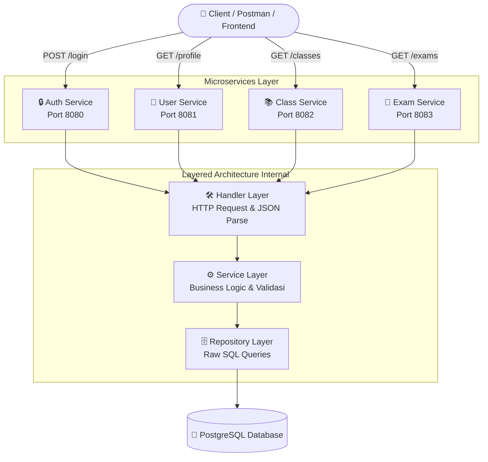

# Go Exam Microservices API

<p align="center">
  
  
  
  
</p>

Aplikasi Backend berbasis **Golang** menggunakan pendekatan arsitektur **Microservices** dengan pola terstruktur *Layered Architecture* (Handler ➝ Service ➝ Repository). Aplikasi ini dirancang untuk mengelola sistem pendaftaran, profil pengguna (dengan *Roles*), serta manajemen Kelas (Class) dan Ujian (Exam).

## 🚀 Teknologi yang Digunakan
*   **Bahasa Utama:** Go (Golang 1.22)
*   **Web Framework:** Labstack Echo v4.15.0
*   **Database:** PostgreSQL (menggunakan Driver `lib/pq` & `database/sql` tanpa ORM)
*   **Keamanan & Auth:** golang-jwt/jwt/v5 & golang.org/x/crypto/bcrypt
*   **Dokumentasi API:** Swaggo / Echo-Swagger
*   **ID Generator:** Google UUID

---

## 🌊 Flow Aplikasi (Application Flow)

Aplikasi ini menggunakan pola **Layered Architecture** pada masing-masing layanannya. Berikut adalah gambaran visual diagram bagaimana data mengalir dari Klien hingga ke Database utama secara independen:



**Penjelasan Alur (Flow):**
1. **Client** mengirim HTTP Request ke salah satu Microservice melalui *Port* masing-masing layanan.
2. **Handler** bertugas murni sebagai gerbang: ia menerima *request*, memverifikasi kredensial (seperti *JWT Middleware* untuk `user`, `class`, dan `exam`), dan me-mapping (*Bind*) payload JSON Body ke bentuk *Struct Golang*.
3. **Service** mengeksekusi logika bisnis inti (seperti validasi ketersediaan pengguna, manipulasi data payload, enkripsi *password*, atau pembuatan *JWT Token*) dengan cara memanggil fungsi dari Repository.
4. **Repository** merupakan titik terakhir tempat Golang berinteraksi langsung untuk mengeksekusi *Raw Database Query* (`INSERT`, `SELECT`, dll) ke Layer **PostgreSQL**, kemudian mengembalikan kembalian data (*return value*) kembali ke atas secara sekuensial.

---

## 🏗️ Struktur Microservices & Port
| Microservice  | Port  | Deskripsi Fungsi | Endpoints Utama | Docs (Swagger) |
| :--- | :--- | :--- | :--- | :--- |
| **Auth** | `8080` | Registrasi, Login & Refresh Token | `/register`, `/login`, `/refresh` | `http://localhost:8080/swagger/index.html` |
| **User** | `8081` | Berurusan dengan Profil Pengguna | `/profile` | `http://localhost:8081/swagger/index.html` |
| **Class** | `8082` | Menambah dan Melihat Kelas | `/classes` | `http://localhost:8082/swagger/index.html` |
| **Exam** | `8083` | Menambah dan Melihat Ujian (Per kelas) | `/exams` | `http://localhost:8083/swagger/index.html` |

Semua *endpoint* selain Registrasi dan Login (yaitu pada User, Class, Exam) dilindungi ketat dengan Middleware **JWT Bearer Token**.

---

## 📂 Struktur Folder
```text
exam/
├── cmd/                # Entrypoint (main.go) untuk setiap microservice
│   ├── auth/           
│   ├── user/           
│   ├── class/          
│   └── exam/           
├── internal/           # Domain Layered Architecture
│   ├── auth/           # Handler, Service, Repository khusus Auth
│   ├── user/           # Handler, Service, Repository khusus User
│   ├── class/          # Handler, Service, Repository khusus Class
│   ├── exam/           # Handler, Service, Repository khusus Exam
│   └── pkg/            # Core dan Shareables
│       ├── config/     # Konfigurasi ENV
│       ├── db/         # Setup dan Inisialisasi Tabel Postgres
│       ├── middleware/ # Kostumisasi JWT Auth Middleware
│       └── models/     # Model Struct & Payload Database
├── Makefile            # Skrip kemudahan eksekusi
├── generate_swagger.sh # Skrip build file Docs Swagger
├── .env                # Variabel Lingkungan
└── README.md           # Anda berada di sini
```

---

## 💻 Cara Menjalankan Project

### 1. Persiapan Database
Pastikan PostgreSQL sedang berjalan di mesin lokal Anda. Inisialisasi tabel sudah **diotomatisasi** oleh Go pada saat program pertama kali berjalan (melalui package `internal/pkg/db`). Anda hanya perlu menyiapkan *user*, *password*, dan sebuah database kosong.

Di dalam file `.env` (atau `config.go`), atur kredensial Anda, seperti:
```env
DB_HOST=localhost
DB_PORT=5432
DB_USER=your_username
DB_PASSWORD=your_password
DB_NAME=your_database_name
DB_SSLMODE=disable
JWT_SECRET=your_jwt_secret
```

### 2. Install Modul dan Dependency
```bash
go mod tidy
```

### 3. Menjalankan Semua Layanan (Sekaligus)
Buka terminal Anda di *root* repository ini, lalu berikan perintah Makefile berikut:
```bash
make run-all
```
Maka, ke-empat server (8080, 8081, 8082, 8083) akan menyala seketika dan mencetak *log* ke Terminal secara transparan dan bersama-sama.

### 4. Perbarui Dokumentasi Swagger (Optional)
Bila sewaktu-waktu Anda menambah metode Endpoints tambahan ke *controllers* (`handler.go`), Anda perlu memperbarui file JSON Swagger dengan eksekusi:
```bash
bash generate_swagger.sh
```

---

## ✨ Catatan Autentikasi Menggunakan Swagger
1. Lakukan `POST /register` dan `POST /login` melalui **Auth Service Swagger** (`localhost:8080/swagger/index.html`).
2. Saat berhasil `login`, respons akan mengembalikan `access_token` dan `refresh_token`.
3. Buka **Swagger UI khusus layanan yang dituju** (Contoh untuk membuat kelas: jalankan di UI Class Service `http://localhost:8082/swagger/index.html`).
4. Klik tombol hijau bernama **Authorize** (berikon gembok).
5. Masukkan data token dengan format `Bearer <spasi> token_anda` (Ganti `token_anda` dengan kode *access_token* poin 2).
6. Uji (`Execute`) Endpoint API yang diproteksi tersebut secara leluasa!
